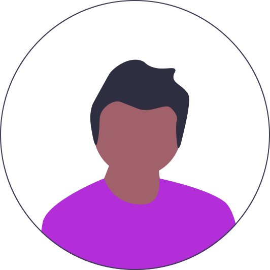

  
  
  <h1>Apika Luca</h1>
  

    Welcome. 
    I'm Brayan, a guy who learns very quickly.  
    8+ years Developer Experience.  
    🦀 Rustacean 🦀  
    💻 Compilers 💻  
  

    

    
  </a>

## Languages

## Tech

  

## Editors

## OS's

